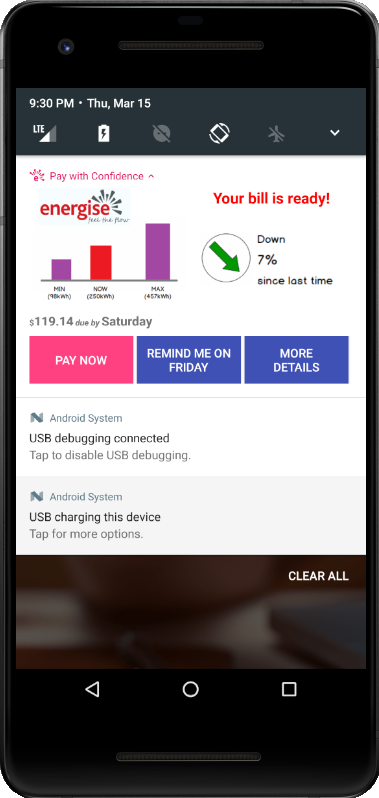

# Pay with Confidence

Getting parted with the money is always a very sensitive topic, even if this is just another electricity bill. Although, automatic bill payment plans make your customers’ life easier ensuring them that bills are paid on time and in full each month, not everyone feels comfortable with funds withdrawals made without any control on their side. This is where manual payments bubble up. Totally controlled by customer, they require just a bit of customer’s attention once the latter got notified that the bill was ready. In this demo, we show how you can use rich push notification from your mobile application to let your customer make well-informed payment decision and pay their bill with confidence in one click, keeping things under control.



Rich push notifications are essentially push notifications that support rich media attachments such as images, videos, audio, and interactive buttons. Therefore, rich push notifications expand your arsenal of creating meaningful connections with your customers using a mobile app. Advanced notifications help to convey meaning with images, further improving your overall engagement strategy.

In this demo we connect the Gentrack Platform to an integration layer, represented by Heroku. This layer extracts a bit of extra data that might typically reside in a CRM, and sends the combined set to Taplytics to trigger the automation pathway. The process flows as follows:


1. A bill is generated for a customer in a Gentrack core system.
2. The core system triggers and publishes an event to the Gentrack Platform.
3. The Gentrack Platform then sends the event to a registered webhook – a NodeJS/Express application that receives bill events from the Platform and then pushes notifications to registered devices using Taplytics APIs.
4. The webhook sends a rich push notification to a utility customer's mobile device.

As you think about your production deployment you might choose other methods for integration (e.g. event bus, workflow-based integration layer, etc...). Our sample integration layer also hosts a simple data set that might be obtained from a customer relationship management (CRM) system. You will also want to consider how to secure secrets, such as API keys, in your integration layer.

## Before you begin

You will need to have:

* [Gentrack Platform Developer Portal](https://portal.gentrack.io) Account - contact your organisation administrator to get an invite, or your account manager to enroll your organisation
* [Taplytics](https://taplytics.com/) Account
* Google Account in order to
  * sign in to [Firebase](https://firebase.google.com/)
  * receive push notifications from an emulator
* [Heroku](https://www.heroku.com/) Account
* [Android Studio 3.x](https://developer.android.com/studio/index.html)
* Android SDK and Platform Tools version 27 for building the Android application. Refer to the [Android Studio user guide](https://developer.android.com/studio/intro/update.html) on installing and updating Android SDK and Platform tools
* An Android emulator to run the Android application. The emulator must use an image with `API level = 24` and `Target = Android 7.0 (Google APIs)`. Do not worry about the emulator now – you will find a step-by-step guide how to create the emulator with such requirements below - when we need it for the Demo.

## Create a Taplytics App
To be able to send push notifications, we need to create a Taplytics App.

1. Log in to [Taplytics](https://taplytics.com/)
2. On the main page, select **Add a New Project**
3. In the dialog opened, give a name to your new app, then click **Create App**
4. To connect Taplytics to your newly created app, select **Android / TV / Fire TV**
5. In the __SDK Setup Instructions__, find the values for **Android SDK key** and **Android URL scheme** for your app 
```
....
# Android SDK key
Taplytics.startTaplytics(this, "**6e9baefa4c41c429f327887f2401a43a48e372ce**");
...
# Android URL scheme
<data android:scheme="**tl-06ba23aa**"/>
...
```
You will need to provide those to the Android application we will build as a next step.

## Build Android Application

1. Click the button **Clone or download** at the top of this page and save the demo project to a local directory.
2. Launch __Android Studio__, then choose **Open an Existing Android Studio Project** in the dialog opened. 
3. In the dialog, navigate to the directory you have saved the project to, and open the directory **mobileAppAndroid** in the project.
4. In Android Studio, open ‘mobileAppAndroid\app\src\main\res\values\strings.xml’
5. At the bottom of __strings.xml__, update `taplytics_android_sdk_key` and `taplytics_android_sdk_key` with the key definitions of your Taplytics application, obtained earlier.
6. Build the application.

## Create Android Emulator

To be able to run the Android application, we need an Android emulator to be created first.
1. In __Android Studio__, on the toolbar click **AVD Manager** icon 
2. In the __Android Virtual Device Manager__, click the button **+ Create Virtual Device…** 
3. In the __Virtual Device Configuration__ wizard, choose the Category **Phone** and Name **Pixel 2**, then click **Next**
4. Select **Nougat**, then click **Next**
5. Provide a value for **AVD Name** or keep the default value, then click **Finish**
6. Log in to your **Google account** in the emulator in order to receive push notifications.

## Run Android Application

1. Run the application in the emulator. 
The Android application will connect to Taplytics, allowing it to finish SDK integration for your application.

## Finish Configuration

1. Log in to [Firebase](https://firebase.google.com/) using your Google account.
2. In the [Firebase Console]( https://console.firebase.google.com/), create a new Firebase project by clicking on **+ Add project**.
3. On the __Add a project__ page, populate the following values then click **Create Project**
   * Project name
   * Country/region – choose a region that suits you
4. Click **Continue** once you are advised that your new project is ready
5. On the Firebase left side bar, click the **Settings** icon and select **Project settings**
6. On the __Cloud Messaging__ page, click the button **Add Server Key**. You will need to provide **Server ID** and two **Server key tokens** to __Google Cloud Messaging__ in Taplytics
7. On the Taplytics __Dashboard__ page, click **Settings**
8. On the _Settings__ page, copy **Taplytics REST API Private Key** - save it for later
9. On the __Settings__ page, select **Push Notification Settings**
10. On the __Production GCM Credentials__ under __Google Cloud Messaging__ Section, populate the following values then click **Save Credentials**
   * SENDER ID - Sender ID you obtained on the step 6
   * GCM API KEY – The first Server key token you obtained on the step 6
11. On the __Development GCM Credentials__ under __Google Cloud Messaging__ Section, populate the following values then click **Save Development Credentials**
   * SENDER ID - Sender ID you obtained on the step 6
   * GCM API KEY – The second Server key token you obtained on the step 6
12. In __Android Studio__, restart the Android application, and it is ready to receive push notifications.

## Obtain Gentrack Platform app public key

Before you deploy the integration, you will need the public key of your Gentrack Platform app definition to verify that received events are valid.
1. Sign in to the [Gentrack Platform Developer Portal](https://portal.gentrack.io/)
2. Add a new app using your non-production tenant
3. Open the app settings and copy the public key - save it for later.

## Deploy the sample integration on Heroku

It is time to deploy the integration. This will setup an app in Heroku to connect Taplytics and Gentrack Platform.
1. Click the **Deploy to Heroku** button to create a new instance of this sample integration:
[](https://heroku.com/deploy?template=https://github.com/gentrack/platform-demo-pay-with-confidence)
2. On the __Create New App__, populate the following values, then click **Deploy app**
    * App name - provide a value, or leave it blank to let Heroku generate a value
    * Region - chooses a region that suits you
    * PUBLIC_KEY – paste the Platform public key you obtained earlier
    * TAPLYTICS_API_TOKEN – paste the Taplytics REST API Private Key you obtained earlier
    
Once the application is deployed, you will be able to access the integration console at `https://(your-app-name).herokuapp.com/admin`.

## Subscribe to the bill-ready event and send a test event

Now that the integration layer is configured, and the Android application is built, it is time to connect the app you created earlier in the Gentrack Platform Developer Portal to the integration layer and send a test event:

1. Sign in to the [Gentrack Platform Developer Portal](https://portal.gentrack.io/)
2. Open the app settings for the app you created earlier
3. Under __App Settings__, click **Event Subscriptions**
4. On the __Event Subscriptions__ page, click **Edit**
5. In the __Edit Events__ dialog, provide the following then click **Save**:
    * URL of your End Point: `https://(your-app-name).herokuapp.com/webhook/`
    * Select the **bill-ready** event
6. Once the event is subscribed, click the **Send Test Event** button
7. In the __Send Test Event__ dialog, populate the following values or use the default ones, then click **Send**
    * accountID – Unique identifier of the account holder
    * dueDate – Date that the next payment is due on
    * dueAmount – Next payment amount required

In a few moments you should receive your sample push notification! Pull the notification down to get a richer content. Click on the buttons and see what will happen!

## Cleaning up your resources

Make sure to clean up after you are done experimenting with the sample, otherwise you may incur unexpected costs associated with each of the services:

* In Taplytics, you can delete the application
* In Firebase, you can delete the project
* In Heroku, you can delete the application
* In Gentrack Platform, you can delete the application